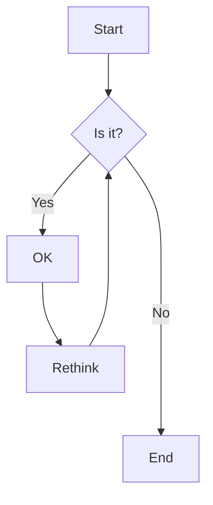



Here is an example of headings. You can use this heading by the following markdown rules. For example: use `#` for heading 1 and use `######` for heading 6.

# Heading 1

## Heading 2

### Heading 3

#### Heading 4

##### Heading 5

###### Heading 6

<hr>

### List of Publications

[8] **Comprehensive SCME: a nonlinear large-deformation modeling approach for general planar compliant mechanisms**
   Tinghao Liu; Guangbo Hao 
   *Mechanism and Machine Theory*

[7] **Precision polishing platform based on a flexure-based constant force mechanism**
   Tinghao Liu; Guangbo Hao 
   *euspen’s 24th International Conference & Exhibition*

[6] **Modeling compliant bistable mechanisms: An energy method based on the high-order smooth curvature model**
   Tinghao Liu; Guangbo Hao; Jiaxiang Zhu; Pongsiri Kuregsangsai; Salih Abdelaziz; Erich Wehrle
   *International Journal of Mechanical Sciences*

[5] **An electromagnetic vibration energy harvester with compact flexure guide for low frequency applications**
   Lujie Wang; Tinghao Liu; Guangbo Hao; Saha Chitta; Lei Liu; TinCong Ye; Zhengmin Zhang; Ningning Wang
   *Smart Materials and Structures*

[4] **Design of an over-constraint based nearly-constant amplification ratio compliant mechanism**
   Jiaxiang Zhu; Guangbo Hao; Tinghao Liu; Haiyang Li
   *Mechanism and Machine Theory*

[3] **Design and Nonlinear Analysis of an Overconstraint Based Constant Amplification Ration Compliant Mechanism**
   Jiaxiang Zhu; Guangbo Hao; Tinghao Liu; Haiyang Li
   *ASME IDETC-CIE 2022*
   
[2] **Design of a Cylindrical Compliant Linear Guide with Decoupling Parallelogram Mechanisms**
   Tinghao Liu; Guangbo Hao
   *Micromachines*
 
<table style="border-collapse:collapse; border:none;">
  <tr>
    <td valign="top" style="padding-right:6px;">[8]</td>
    <td style="border:none; padding:0;">
      <strong>Design of deployable structures by using bistable compliant mechanisms</strong><br>
      <span style="color:#2d80cc">Tinghao Liu</span>; Guangbo Hao<br>
      <em>Mechanism and Machine Theory</em>
    </td>
  </tr>
</table>


<hr>

### Emphasis

The emphasis, aka italics, with _asterisks_ or _underscores_.

Strong emphasis, aka bold, with **asterisks** or **underscores**.

The combined emphasis with **asterisks and _underscores_**.

Strike through uses two tildes. ~~Scratch this.~~

<hr>

### Button



<hr>

### Link

[I'm an inline-style link](https://www.google.com)

[I'm an inline-style link with title](https://www.google.com "Google's Homepage")

[I'm a reference-style link][Arbitrary case-insensitive reference text]

[I'm a relative reference to a repository file](../blob/master/LICENSE)

[You can use numbers for reference-style link definitions][1]

Or leave it empty and use the [link text itself].

URLs and URLs in angle brackets will automatically get turned into links.
<http://www.example.com> or <http://www.example.com> and sometimes
example.com (but not on Github, for example).

Some text to show that the reference links can follow later.

[arbitrary case-insensitive reference text]: https://www.themefisher.com
[1]: https://gethugothemes.com
[link text itself]: https://www.getjekyllthemes.com

<hr>

### Paragraph

Lorem ipsum dolor sit amet consectetur adipisicing elit. Quam nihil enim maxime corporis cumque totam aliquid nam sint inventore optio modi neque laborum officiis necessitatibus, facilis placeat pariatur! Voluptatem, sed harum pariatur adipisci voluptates voluptatum cumque, porro sint minima similique magni perferendis fuga! Optio vel ipsum excepturi tempore reiciendis id quidem? Vel in, doloribus debitis nesciunt fugit sequi magnam accusantium modi neque quis, vitae velit, pariatur harum autem a! Velit impedit atque maiores animi possimus asperiores natus repellendus excepturi sint architecto eligendi non, omnis nihil. Facilis, doloremque illum. Fugit optio laborum minus debitis natus illo perspiciatis corporis voluptatum rerum laboriosam.

<hr>

### Ordered List


<hr>

### Unordered List

- List item
- List item
- List item
- List item
- List item

<hr>

### Notice


This is a simple note.



This is a simple tip.



This is a simple info.



This is a simple warning.


<hr>

### Tab




#### Hey There, I am a tab

Lorem ipsum dolor sit amet, consetetur sadipscing elitr, sed diam nonumy eirmod tempor invidunt ut labore et dolore magna aliquyam erat, sed diam voluptua. At vero eos et accusam et justo duo dolores et ea rebum. Stet clita kasd gubergren, no sea takimata sanctus est Lorem ipsum dolor sit amet.





#### I wanna talk about the assassination attempt

Lorem ipsum dolor sit amet, consetetur sadipscing elitr, sed diam nonumy eirmod tempor invidunt ut labore et dolore magna aliquyam erat, sed diam voluptua. At vero eos et accusam et justo duo dolores et ea rebum. Stet clita kasd gubergren, no sea takimata sanctus est Lorem ipsum dolor sit amet.

Lorem ipsum dolor sit amet, consetetur sadipscing elitr, sed diam nonumy eirmod tempor invidunt ut labore et dolore magna aliquyam erat, sed diam voluptua. At vero eos et accusam et justo duo dolores et ea rebum. Stet clita kasd gubergren, no sea takimata sanctus est Lorem ipsum dolor sit amet.





#### We know you’re dealing in stolen ore

Lorem ipsum dolor sit amet, consetetur sadipscing elitr, sed diam nonumy eirmod tempor invidunt ut labore et dolore magna aliquyam erat, sed diam voluptua. At vero eos et accusam et justo duo dolores et ea rebum. Stet clita kasd gubergren, no sea takimata sanctus est Lorem ipsum dolor sit amet.

Lorem ipsum dolor sit amet, consetetur sadipscing elitr, sed diam nonumy eirmod tempor invidunt ut labore et dolore magna aliquyam erat, sed diam voluptua. At vero eos et accusam et justo duo




<hr>

### Accordions



- Lorem ipsum dolor sit amet consectetur adipisicing elit.
- Lorem ipsum dolor sit amet consectetur adipisicing elit.
- Lorem ipsum dolor sit amet consectetur





- Lorem ipsum dolor sit amet consectetur adipisicing elit.
- Lorem ipsum dolor sit amet consectetur adipisicing elit.
- Lorem ipsum dolor sit amet consectetur





- Lorem ipsum dolor sit amet consectetur adipisicing elit.
- Lorem ipsum dolor sit amet consectetur adipisicing elit.
- Lorem ipsum dolor sit amet consectetur



<hr>

### Code and Syntax Highlighting

This is an `Inline code` sample.

```javascript
var s = "JavaScript syntax highlighting";
alert(s);
```

```python
s = "Python syntax highlighting"
print s
```

```c  { linenos=true }
#include <stdio.h>

int main(void)
{
    printf("hello, world\n");
    return 0;
}
```



<hr>

### Blockquote

> Did you come here for something in particular or just general Riker-bashing? And blowing into maximum warp speed, you appeared for an instant to be in two places at once.

<hr>

### Tables

| Tables        |      Are      |  Cool |
| ------------- | :-----------: | ----: |
| col 3 is      | right-aligned | $1600 |
| col 2 is      |   centered    |   $12 |
| zebra stripes |   are neat    |    $1 |

<hr>

### Image



<hr>

### Gallery



<hr>

### Slider



<hr>

### Youtube video



<hr>

### Custom video


